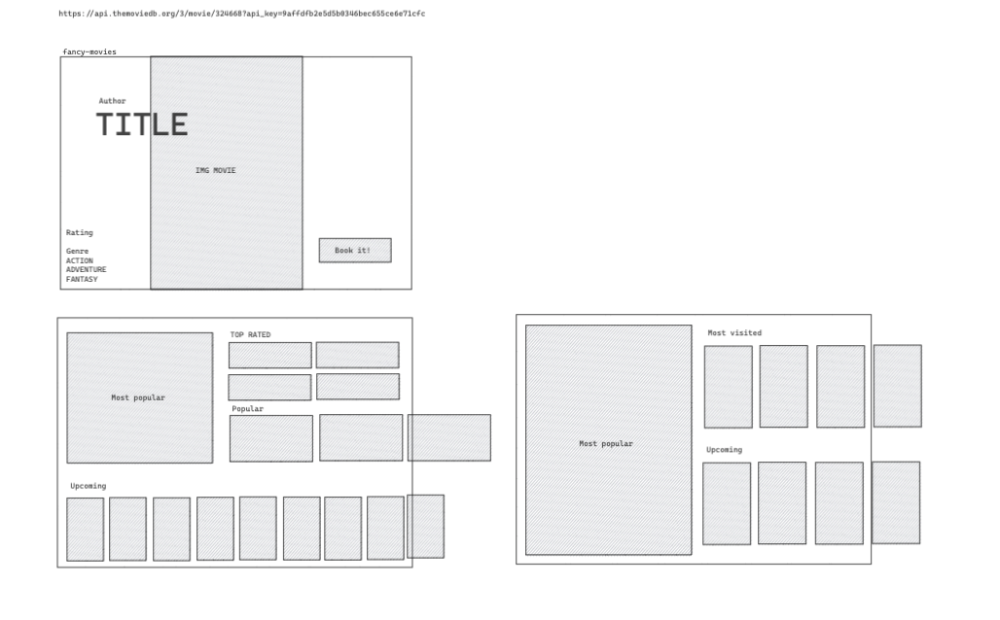
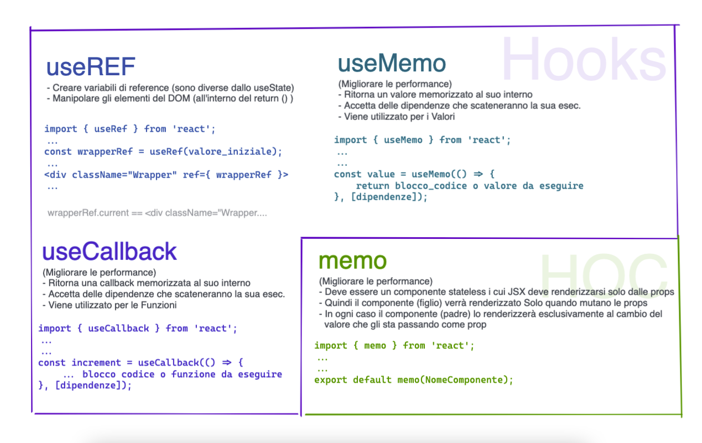

# Esercitazione - 30 Agosto

### ESERCIZIO 1
- Sulla base della lezione odierna, creare un account e ottenere una api-key da MovieDB `https://www.themoviedb.org/`

- Sostituire nell'opportuno file, relativo alla GET, la nuova key ottenuta

- Collegare il componente Input, di modo che, alla ricerca di un id, parta la chimata.
(attenzione, composto da 6 cifre, fate attenzione che sia valido prima anche via browser)

### ESERCIZIO 2
- Se non risolvto già ad esercizio 1, è possibile far avvenire la chiamata fetch senza forzare il refresh della pagina? Ovvero, una volta che l'utente finale ha cliccato su 'search', possiamo avere il risultato senza reload? :)

- Provare a customizzare il componente Input a scelta, l'importante è che lo studente sia forzato a riprendere gli argomenti CSS.

### Per gli audaci
- Riguardo al punto 2 dell'esercizio 2, è possibile avere il risultato di cui abbiamo parlato a lezione? Ovvero il `search` della input come cerchio al cui click si anima e si espande la input, precedentemente nascosta. (Attenzione: questo es. non è obbligatorio!)

# Esercitazione - 31 Agosto

### ESERCIZIO 1
- Sulla base della lezione del giorno, trasformare la prop `cardStyle` di MainCard di modo chè accetti non più lo stile dinamico bensì una classe dinamica definita nello setto MainCard.
- Adottare le dovute accortezze anche su TopRatedList

### ESERCIZIO 2 
- Continuare con il rendering dei vari elementi che arrivano via chiamata API in MainSection, seguendo quello che è il mock design di seguito (o fare pure a scelta propria). L'unica richiesta è usare tutte e tre le chiamate, anche parzialmente.

# Esercitazione - 1 Settembre

### ESERCIZIO 1
- All'interno del componente MainSection trovare una soluzione valida alla riga 32 per quanto riguarda il filtro dei movies Top Rated, riguado al problemino sollevatosi a lezione

- Sulla base della lezione del giorno, modificare il componente Navbar di modo che sia ormai più "fit" possibile con il vostro progettino (man mano sempre più completo)

- Rileggere e comprendere (per bene!) il funzionamento dell'`addEventListener` applicato al componente MainInput, nella fattispecie il comportamento che allo scroll della pagina fa comparire la input e il bottone di ricerca. 
##### Consiglio vivamente di cancellare tutto il codice relativo e riscriverlo

### ESERCIZIO 2
- Creare un componente MainModal che verrà lanciata al click del componente MainCard. Ricordo di passare i dati perchè serviranno per renderizzare il contenuto della modale stessa in base al film cliccato

# Esercitazione - 2 Settembre

### ESERCIZIO 1
- Sulla base della lezione del giorno, rivedere tutto il progetto, ottimizzarlo o implmentare funzionalità se necessario.

- Utilizzare la `HOC memo` al fine di migliorare la performance di quei componenti che rispettano l'utilizzo di tale processo di improve.

- Ricreare la struttura del progetto vista a fine lezione, provare a ridisegnarla (anche con excalidraw) senza guardare la lezione stessa.
(Saper organizzare una struttura grafica (architettura) di progetto è utilissimo, sopratutto quando il progetto acquisisce volume e complessità)

### Avanzato
- Al fine di una ottimizzazione totale dell'applicazione, cerca e applicare, dove necessario, anche `useCallback` e `useMemo`, tenendo sempre a mente la differenza di utilizzo, quando usare uno o l'altro.

##### Riepilogo finale

# Esercitazione - 5 Settembre

### ESERCIZIO 1
- Sulla base della lezione del giorno: tradurre tutti i fogli di stile (.css), di ogni componente, ora in SASS (.scss)
- Adottare tutte le caratteristiche introdotte a lezione: indentazione, variabili (qual'ora si faccia ricorso ad esse, vedi avanzato)
- Per chi non avesse finito o (implementato) in proprio progetto, recuperare questa parte
- Per chi non avesse caricato il tutto su Github, procedere anche qui

### Avanzato
- Creare un file di `_variables` che contenga variabili per la gestione della palette dei colori dell'applicazione intera

# Esercitazione - 5 Settembre

### ESERCIZIO 1
- Sulla base della lezione del giorno: creare un file realativo chiamato `_mixins` e creare tanti quanti necessari mixins da applicare a tutta l'intera applicazione, quindi componente per componente.
- Sostituire la vecchia sintassi CSS ora utilizzando SCSS

### Avanzato
- Semplicemente: aggiungere funzionalità al vostro progetto!